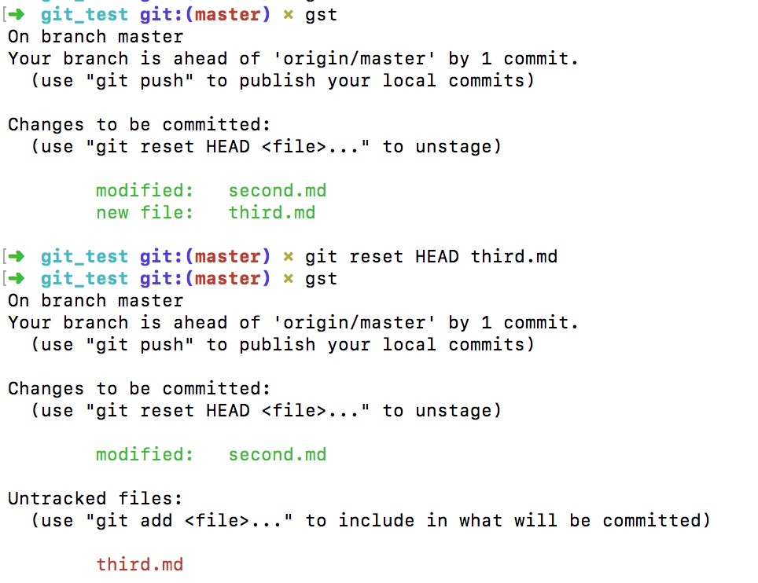

我们知道，`$ git reset --hard`是一个非常危险的操作。所以对 reset 一直心生敬畏。其实，不加选项地调用 git reset 并不危险 —- 它只会修改暂存区域。。

- 把暂存区的某一个文件删除（提交到暂存区的内容不好，可以删除）

	`$ git rm --cached xxx.xx`
	`$ git rm --cached . -r`  删除暂存区中所有提交的 
	如果在删除过程中，发现从暂存区删除的文件，在工作区已经被修改了，只有加上 -f 才能强制从暂存区把内容删除掉

- 把最近暂存区中的内容删除掉

	`$ git reset HEAD .`
	紧接着执行，把工作区的修改全部撤回
	`$ git checkout . 或 xxx.xx`

# reset HEAD：撤销暂存区的内容

`$ git reset HEAD .`：撤销暂存区中所有的内容。

撤销部分内容：
比如，不小心 add 了两个文件，但是是想让这两个文件独立提交的，如何只取消暂存两个中的一个呢？

使用 `$ git reset HEAD xxx.xx`

# reset --hard

`$ git reset --hard commitId`：强制把工作区、暂存区都回退到某一个版本
`$ git reset --hard HEAD^`：回退一个位置（前一个版本）的 commit【父 commit】

配合 `$ git reflog` 查看原先的commit SHA-1 码

注意：reset --hard 是直接丢弃，reset HEAD 是将暂存区的撤回来继续修改。

# revert

[Git 之 revert](https://segmentfault.com/a/1190000012897697)

# checkout：撤销工作区修改

`$ git checkout [. 或 xxx.xx]`：撤销工作区的修改，还原上次提交时（或者刚克隆时，或者上次刚 pull 下来 ）的样子。

有时我们修改了很久，发现修改思路错了，需要将某一个文件还原到修改之前，其他文件不需要还原，就会用这个命令，但这是一个危险的命令，一旦使用，这个文件的修改就都没了。

记住，在 Git 中任何 已提交的 东西几乎总是可以恢复的。
